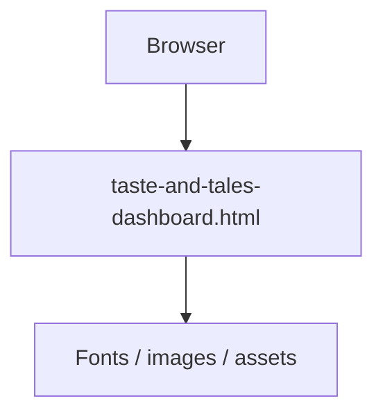

# Taste and Tales

Single-page restaurant / food brand dashboard built as a self-contained HTML prototype. Good for pitching menus, stories, and a warm visual identity without a heavy build step.

Live: https://taste-and-tales-swart.vercel.app

## What is in the repo

- `taste-and-tales-dashboard.html` - full UI (layout, sections, styling)
- Deployable as a static site on Vercel or any static host

## Architecture



Static page only. No backend, no build tooling required.

## Run it

Open the HTML file in a browser:

```bash
open taste-and-tales-dashboard.html
```

Or serve locally:

```bash
python3 -m http.server 5500
# then visit http://127.0.0.1:5500/taste-and-tales-dashboard.html
```

## Deploy

Connect this repo to Vercel (or Netlify) and set the publish directory to the repo root. Point the entry at `taste-and-tales-dashboard.html` if your host needs an explicit index.
